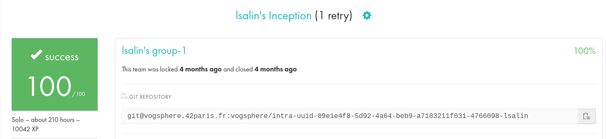

# Inception

🇫🇷

Inception est un projet d'administration système introduisant à l'utilisation de Docker 🐋
Le but du projet est de mettre en place une mini-infrastructure configurée dans une machine virtuelle, et qui utilise différents services : NGINX, WordPress et MariaDB.

Chaque service devra tourner dans son propre container, qui seront ensuite reliés via un fichier docker-compose.yml (appelés par notre Makefile).

__Configuration detailee__ :

* Un container Docker contenant NGINX avec TLSv1.3.
* Un container Docker contenant WordPress + php-fpm
* Un container Docker contenant MariaDB.
* Un volume contenant notre base de données WordPress
* Un volume contenant les fichiers de notre site WordPress.
* Un docker-network qui fait le lien entre nos containers.

🇺🇸

Inception is a system administration project introducing to Docker 🐋
The goal of the project is to set up a mini-infrastructure configured in a virtual machine, and which uses different services: NGINX, WordPress and MariaDB.

Each service will have to run in its own container, which will then be linked via a docker-compose.yml file (called by our Makefile).

__Detailed configuration__:

* A Docker container containing NGINX with TLSv1.3.
* A Docker container containing WordPress + php-fpm
* A Docker container containing MariaDB.
* A volume containing our WordPress database
* A volume containing the files of our WordPress site.
* A docker-network that links our containers.

